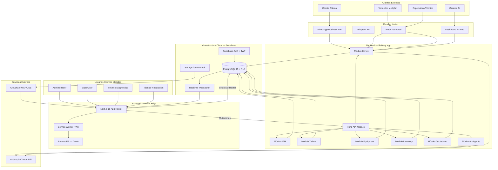
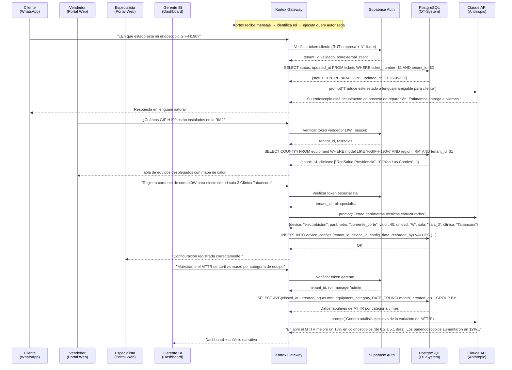
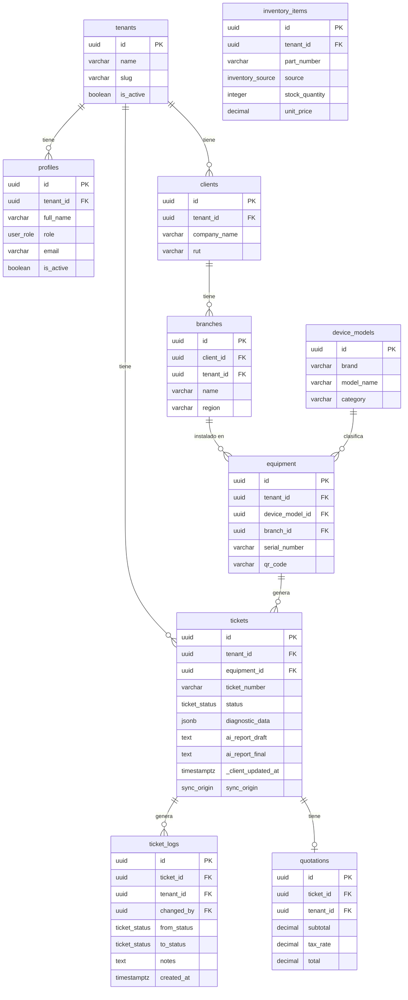
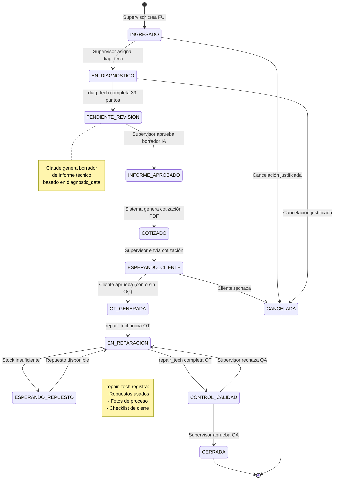
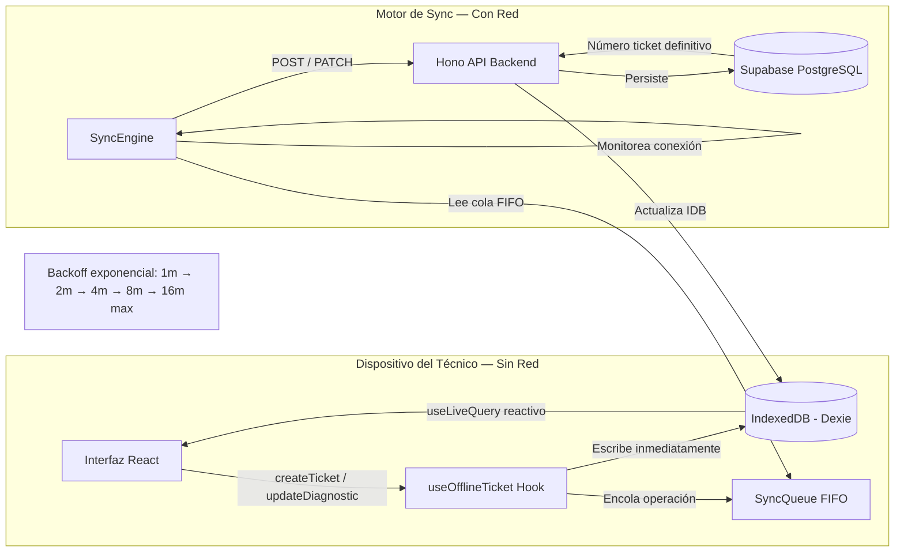

# Informe de Pre Diseño y Catálogo de Servicios TI
## Ecosistema FluCore — Cliente: Medplan S.A.

**Versión:** 1.0  
**Fecha:** Mayo 2026  
**Institución:** Instituto Profesional INACAP  
**Asignatura:** Gestión de Servicios TI  
**Autor:** Varios 
**Clasificación:** Confidencial — Uso académico y presentación a cliente

---

## Tabla de Contenidos

1. [Introducción](#1-introducción)
2. [Análisis de Mercado](#2-análisis-de-mercado)
3. [Levantamiento de Requerimientos del Negocio](#3-levantamiento-de-requerimientos-del-negocio)
4. [Diseño del Servicio TI](#4-diseño-del-servicio-ti)
5. [Catálogo de Servicios TI](#5-catálogo-de-servicios-ti)
6. [Diseño Técnico Funcional](#6-diseño-técnico-funcional)
7. [Métricas y SLA](#7-métricas-y-sla)
8. [Valor para el Negocio](#8-valor-para-el-negocio)
9. [Conclusiones](#9-conclusiones)

---

## 1. Introducción

### 1.1 Descripción del Cliente

**Medplan S.A.** es una empresa biomédica chilena con presencia en la Región Metropolitana, especializada en el servicio técnico de endoscopía flexible para marcas Olympus, Fuji y Pentax. Su modelo de negocio comprende tres líneas de operación: (i) reparación de equipos médicos de alto costo con garantía técnica documentada, (ii) arriendo de endoscopios refaccionados a clínicas y hospitales, y (iii) comercialización de equipos desarmados como fuente alternativa a los representantes oficiales —a una fracción del costo.

Medplan opera en un nicho altamente especializado donde la trazabilidad técnica del equipo y la velocidad de respuesta son determinantes para la relación comercial con grandes redes hospitalarias como RedSalud, Clínica Las Condes y centros de salud del sector público. Cada unidad de endoscopio procesada puede representar desde CLP $500.000 hasta CLP $5.000.000 en reparaciones, lo cual exige que la documentación del proceso sea impecable.

### 1.2 Problemática Actual

El diagnóstico inicial del estado operativo de Medplan revela un conjunto de **silos de información** que generan pérdidas de trazabilidad, errores de facturación y cuellos de botella en la gestión del taller:

| Síntoma | Impacto Operativo |
|---|---|
| Registro de FUI en papel o Excel | Pérdida de historial por número de serie. Imposible auditar en remoto. |
| Coordinación por WhatsApp | Instrucciones sin respaldo, sin SLA implícito, sin escalación formal. |
| Dos fuentes de repuestos desconectadas | "Kame" (ERP, piezas nuevas) y "Desarme" (canibalización) operan en silos. El técnico no sabe si el repuesto está disponible sin consultar manualmente. |
| Informes técnicos redactados en Word | El supervisor pierde entre 2 y 4 horas diarias transcribiendo diagnósticos en vez de gestionar la producción. |
| Sin historial clínico por equipo | Equipos recurrentes no se identifican como problemáticos. Sin datos para negociar preventivos. |
| Comunicación con el cliente no estructurada | El cliente llama para saber el estado; no hay portal ni notificación automática. |

Esta situación genera **opacidad operacional**: la gerencia no puede conocer en tiempo real el estado del taller, los tiempos de ciclo por tipo de equipo, ni los cuellos de botella de inventario.

### 1.3 Objetivo del Ecosistema FluCore

FluCore es una plataforma SaaS (*Software as a Service*) diseñada para digitalizar y sistematizar íntegramente el ciclo de vida del servicio técnico biomédico, desde la recepción del equipo hasta el cierre de la orden de trabajo. El ecosistema se articula en tres servicios complementarios:

1. **OT-System**: Motor de gestión de tickets y órdenes de trabajo (core operacional).
2. **Kortex**: Gateway conversacional de inteligencia de negocios y soporte multirol basado en lenguaje natural.
3. **Servicio de Mantenimiento Clínico**: Soporte técnico en terreno articulado a través de la plataforma.

### 1.4 Alcance del Proyecto

El presente informe cubre el **diseño de pre producción** del ecosistema FluCore para el tenant piloto Medplan, con foco en los siguientes límites:

- **Incluido:** Arquitectura cloud, modelo de datos, diseño de servicios, catálogo, SLA y métricas.
- **Excluido:** Hardware de consumo local (notebooks, impresoras), infraestructura física de red interna, integración con sistemas ERP Kame (fase 2).
- **Horizon temporal:** MVP en 10 días hábiles de desarrollo; piloto Medplan en 30 días calendario.

---

## 2. Análisis de Mercado

### 2.1 Análisis PESTEL

El ecosistema FluCore opera en la intersección de tres industrias: tecnología SaaS, biomedicina y servicio técnico especializado. El análisis PESTEL revela las fuerzas macro-ambientales que condicionan la viabilidad y escalabilidad del proyecto.

#### Político

- **Regulación sanitaria (MINSAL):** Los equipos de endoscopía están sujetos a normativa de la Superintendencia de Salud y el ISP. Toda reparación debe estar documentada con trazabilidad de técnico y materiales. FluCore capitaliza esta obligación convirtiéndola en valor: el historial de la plataforma es el expediente regulatorio del equipo.
- **Política de digitalización del sector salud:** El Plan Digital del Ministerio de Salud 2022–2026 exige trazabilidad electrónica de dispositivos médicos, alineando el diseño de FluCore con la dirección regulatoria del mercado.
- **Contratos con hospitales públicos (CENABAST):** Las licitaciones públicas exigen respaldo técnico documentado, para lo cual la exportación de informes PDF de FluCore es un diferenciador directo.

#### Económico

- **Elasticidad del sector salud:** El gasto en equipos biomédicos y su mantenimiento es relativamente inelástico. Las clínicas no pueden prescindir del servicio técnico especializado, lo que reduce el riesgo de churn del cliente de Medplan.
- **Costo de oportunidad del downtime:** Un endoscopio fuera de servicio puede implicar la cancelación de 8–15 procedimientos diarios a CLP $80.000–$200.000 por procedimiento. La velocidad del ciclo de reparación impacta directamente los ingresos del cliente.
- **Modelo SaaS vs. licencia perpetua:** La suscripción mensual (~USD $150–$300/tenant) reduce la barrera de adopción respecto a soluciones on-premise. FluCore apunta a un modelo *land-and-expand* iniciando con Medplan y escalando a otros prestadores de servicio técnico biomédico.
- **Tipo de cambio:** Infraestructura cloud denominada en USD (Supabase, Vercel, Railway) vs. ingresos en CLP. Riesgo de tipo de cambio gestionable dado el bajo costo de la infraestructura (~USD $20–$50/mes en fase MVP).

#### Social

- **Transformación digital en el sector salud:** La pandemia aceleró la adopción de herramientas digitales en clínicas y hospitales, reduciendo la resistencia al cambio en el usuario final.
- **Expectativa de respuesta en tiempo real:** Clientes (directores de mantenimiento clínico) esperan visibilidad del estado de sus equipos sin necesidad de llamar. Kortex responde a esta expectativa con atención conversacional 24/7.
- **Brecha de talento técnico biomédico:** La escasez de técnicos certificados en endoscopía hace que el conocimiento acumulado en FluCore (historial de fallas por modelo, diagnósticos previos) sea un activo estratégico difícil de replicar.

#### Tecnológico

- **Inteligencia Artificial generativa:** La integración de LLMs (Claude de Anthropic) permite automatizar la redacción de informes técnicos, transformando los 39 puntos de diagnóstico estructurado en documentos profesionales en segundos. Kortex extiende esta capacidad al soporte conversacional multirol.
- **Conectividad en terreno:** Los técnicos operan en clínicas con conectividad variable. La arquitectura *offline-first* de FluCore (IndexedDB + PWA) garantiza continuidad operacional sin depender de WiFi estable.
- **Madurez de plataformas BaaS:** Supabase (PostgreSQL + Auth + Storage + Realtime) reduce el costo y tiempo de desarrollo de infraestructura en un 60–70% respecto a soluciones auto-gestionadas.
- **Proliferación de APIs conversacionales:** WhatsApp Business API, Telegram Bot API y WebChat permiten a Kortex desplegarse en los canales que el cliente ya usa, sin fricciones de adopción.

#### Ecológico

- **Eliminación de papel:** FluCore elimina completamente los formularios físicos (FUI, OT, informes), contribuyendo a la reducción de residuos de papel en entornos hospitalarios.
- **Extensión de vida útil de equipos médicos:** Al mejorar la trazabilidad del mantenimiento preventivo, FluCore contribuye a reducir el desecho prematuro de equipos de alto valor, en línea con principios de economía circular.
- **Infraestructura cloud con energía renovable:** Vercel, Railway y Supabase operan en centros de datos con compromisos de energía renovable (AWS us-east, GCP us-central), lo que reduce la huella de carbono respecto a servidores on-premise.

#### Legal

- **Ley 19.628 — Protección de datos personales:** Los datos de pacientes NO son almacenados por FluCore; solo se registran datos técnicos del equipo y operacionales del servicio. Sin embargo, los datos del técnico y del cliente clínica son de carácter personal y deben protegerse.
- **Normativa de firma electrónica:** Los informes técnicos generados por FluCore deben poder validarse como documentos con autoría trazable. La arquitectura de `ticket_logs` inmutable satisface este requerimiento.
- **GDPR (para escalabilidad internacional):** El diseño multi-tenant con aislamiento por `tenant_id` en todas las políticas RLS de PostgreSQL es compatible con requisitos GDPR de derecho al olvido y portabilidad de datos.

---

### 2.2 Las 5 Fuerzas de Porter

#### Fuerza 1: Rivalidad entre Competidores Existentes — MEDIA-ALTA

El mercado de software de gestión de servicio técnico en Latinoamérica cuenta con soluciones horizontales (Zendesk, Jira, ServiceNow) y verticales emergentes. Ninguna solución disponible en el mercado chileno está diseñada específicamente para el servicio técnico de endoscopía biomédica. La rivalidad es alta en el mercado genérico de *field service management*, pero prácticamente nula en el nicho biomédico especializado donde opera FluCore.

#### Fuerza 2: Amenaza de Nuevos Entrantes — BAJA

Las barreras de entrada son significativas: (i) el conocimiento del dominio (protocolos de diagnóstico de endoscopía, nomenclatura de fallas, flujo regulatorio) es altamente especializado y tácito; (ii) el formulario de 39 puntos de diagnóstico desarrollado junto a Medplan constituye una ventaja de conocimiento propietario; (iii) los costos de cambio para el cliente aumentan con el tiempo a medida que el historial por número de serie se acumula en FluCore.

#### Fuerza 3: Poder de Negociación de los Proveedores — BAJA

Los proveedores de infraestructura (Supabase, Vercel, Railway, Anthropic) son plataformas globales con precios de mercado transparentes y sin lock-in absoluto. La arquitectura de FluCore permite migrar el backend a cualquier proveedor de PostgreSQL en menos de 48 horas. El poder de negociación del proveedor es bajo.

#### Fuerza 4: Poder de Negociación de los Clientes — MEDIA

En la fase inicial (Medplan como único tenant), el cliente tiene poder de influenciar el roadmap del producto. Sin embargo, a medida que FluCore incorpore múltiples tenants, este poder se diluye. El diseño multi-tenant desde el origen es una decisión estratégica para reducir esta dependencia.

#### Fuerza 5: Amenaza de Productos Sustitutos — MEDIA

Los sustitutos más comunes son: (i) Excel + WhatsApp (gratuito, alta fricción, nula trazabilidad), (ii) formularios Google Forms + Drive (baja integración), y (iii) ERP genéricos adaptados. Ninguno ofrece la combinación de diagnóstico estructurado + generación de informes con IA + capacidad offline-first. La amenaza de sustitutos es real pero decrece a medida que el historial técnico del cliente se acumula en FluCore.

---

### 2.3 Benchmark de Soluciones Comparables

| Criterio | Zendesk Suite | UpKeep CMMS | Jira Service Mgmt | **FluCore + Kortex** |
|---|---|---|---|---|
| **Dominio objetivo** | Soporte al cliente genérico | Mantenimiento de activos industriales | Gestión de incidentes TI | Servicio técnico biomédico especializado |
| **Diagnóstico estructurado** | ❌ No | ✅ Checklists básicos | ❌ No | ✅ Formulario 39 puntos con JSONB |
| **Generación IA de informes** | ❌ No | ❌ No | ❌ No | ✅ Claude — borrador en segundos |
| **Modo offline** | ❌ No | ✅ Parcial | ❌ No | ✅ Full offline-first (IndexedDB + PWA) |
| **BI conversacional por rol** | ❌ No | ❌ No | ❌ No | ✅ Kortex — 4 roles diferenciados |
| **Multi-tenancy nativa** | ✅ Sí | ✅ Sí | ✅ Sí | ✅ RLS PostgreSQL por tenant_id |
| **Gestión de repuestos** | ❌ No | ✅ Básico | ❌ No | ✅ Kame + Desarme integrados |
| **Flujo de estados regulatorio** | ❌ Genérico | ❌ Genérico | ✅ Configurable | ✅ Máquina de estados biomédica |
| **Precio base mensual (USD)** | $55/agente | $45/usuario | $17/usuario | Estimado $150–300/tenant |
| **Costo de implementación** | Alto | Medio | Alto | Bajo (SaaS nativo) |
| **Soporte en español** | ✅ Sí | ✅ Parcial | ✅ Sí | ✅ Nativo |

**Ventaja competitiva diferencial de Kortex:** Ninguna de las soluciones comparables ofrece un gateway conversacional que adapte sus respuestas y el nivel de información entregada según el rol del interlocutor. Un cliente puede preguntar "¿cuándo estará listo mi endoscopio?" y recibir una estimación en lenguaje natural; un gerente puede preguntar "¿cuál es nuestro MTTR promedio por marca este trimestre?" y obtener un dashboard estructurado. Esta capacidad transforma a FluCore de una herramienta operacional en una plataforma de inteligencia de negocio viva.

---

## 3. Levantamiento de Requerimientos del Negocio

### 3.1 Metodología de Levantamiento

El levantamiento de requerimientos fue realizado mediante entrevistas semi-estructuradas con los roles clave de Medplan (gerente de operaciones, supervisor de taller, técnico de diagnóstico), análisis de flujos de trabajo actuales (shadowing) y revisión de documentación existente (formularios FUI en papel, cotizaciones en Excel, informes Word).

### 3.2 Necesidades Identificadas

| # | Necesidad del Negocio | Área | Prioridad |
|---|---|---|---|
| N01 | Registrar el ingreso de un equipo médico con trazabilidad completa (cliente, equipo, técnico asignado) | Operaciones | Crítica |
| N02 | Ejecutar diagnóstico técnico de 39 puntos de forma estructurada y auditable | Taller | Crítica |
| N03 | Generar informes técnicos profesionales sin carga manual del supervisor | Gerencia | Alta |
| N04 | Consultar el estado de un equipo en tiempo real (para el cliente clínica) | Comercial | Alta |
| N05 | Gestionar dos fuentes de repuestos (Kame y Desarme) en un solo sistema | Inventario | Alta |
| N06 | Generar cotizaciones de reparación con desglose de repuestos y mano de obra | Comercial | Alta |
| N07 | Operar sin conexión a internet en el taller de reparación | Operaciones | Alta |
| N08 | Acceder a métricas de desempeño (MTTR, throughput, CSAT) en tiempo real | Gerencia | Media |
| N09 | Notificar automáticamente al cliente cuando el equipo está listo | Comercial | Media |
| N10 | Consultar historial completo de intervenciones por número de serie | Técnico | Media |
| N11 | Obtener respuestas a consultas técnicas complejas vía bot conversacional | Especialista | Media |
| N12 | Monitorear despliegue de equipos por zona geográfica (para vendedor) | Ventas | Baja |

### 3.3 Clasificación de Requerimientos

#### Requerimientos Funcionales (RF)

| ID | Requerimiento | Servicio | Módulo |
|---|---|---|---|
| RF-01 | El sistema debe permitir crear una Ficha de Ingreso Único (FUI) con datos del equipo, cliente y técnico asignado | OT-System | Tickets |
| RF-02 | El formulario de diagnóstico debe contener 39 puntos con estados (OK / NO_CRITICO / CRITICO / NO_APLICA) y valores numéricos | OT-System | Tickets |
| RF-03 | El sistema debe generar automáticamente un borrador de informe técnico usando IA (Claude) al completar el diagnóstico | OT-System | AI-Agents |
| RF-04 | El supervisor debe poder aprobar o editar el borrador antes de que el informe sea final | OT-System | Tickets |
| RF-05 | El sistema debe generar cotizaciones PDF con desglose de repuestos congelados al precio del momento de cotización | OT-System | Quotations |
| RF-06 | Los técnicos deben poder trabajar completamente offline; la sincronización debe ocurrir automáticamente al reconectar | OT-System | Offline Engine |
| RF-07 | El sistema de inventario debe diferenciar entre repuestos Kame (nuevos) y Desarme (reciclados) | OT-System | Inventory |
| RF-08 | Kortex debe responder consultas en lenguaje natural según el rol autenticado del interlocutor | Kortex | Bot Gateway |
| RF-09 | Kortex-Cliente debe responder sobre el estado de un equipo, tiempos estimados y reportar fallas | Kortex | Client Bot |
| RF-10 | Kortex-Vendedor debe consultar inventario de equipos desplegados por región | Kortex | Sales Bot |
| RF-11 | Kortex-Especialista debe permitir ingresar y consultar configuraciones técnicas (ej. corrientes de electrobisturí por clínica) | Kortex | Tech Bot |
| RF-12 | Kortex-Gerente debe proveer dashboards en tiempo real con métricas de sentimiento, cuellos de botella y KPIs operacionales | Kortex | BI Dashboard |
| RF-13 | El Servicio de Mantenimiento Clínico debe registrar intervenciones en terreno asociadas a tickets existentes | Mant. Clínico | Field Service |
| RF-14 | El sistema debe mantener un log inmutable de cada cambio de estado del ticket (quién, cuándo, desde qué estado) | OT-System | Ticket Logs |
| RF-15 | Los técnicos de campo deben poder capturar fotos del equipo (diagnóstico y reparación) directamente desde tablet | OT-System | Storage |

#### Requerimientos No Funcionales (RNF)

| ID | Requerimiento | Categoría | Valor Objetivo |
|---|---|---|---|
| RNF-01 | Disponibilidad del servicio OT-System | Disponibilidad | 99.5% mensual |
| RNF-02 | Disponibilidad de Kortex | Disponibilidad | 99.0% mensual |
| RNF-03 | Tiempo de respuesta P95 de endpoints de escritura | Performance | < 500ms |
| RNF-04 | Tiempo de respuesta P95 de lecturas Supabase | Performance | < 200ms |
| RNF-05 | Sincronización offline → online tras reconexión | Offline | < 30 segundos |
| RNF-06 | Capacidad de almacenamiento por tenant | Escalabilidad | 50 GB inicial (ampliable) |
| RNF-07 | Aislamiento de datos entre tenants | Seguridad | RLS PostgreSQL en 100% de tablas |
| RNF-08 | Cifrado en tránsito | Seguridad | TLS 1.3 obligatorio |
| RNF-09 | Cifrado en reposo | Seguridad | AES-256 (Supabase default) |
| RNF-10 | Autenticación multifactor disponible | Seguridad | TOTP opcional por tenant |
| RNF-11 | Soporte de hasta 50 usuarios concurrentes por tenant | Escalabilidad | Sin degradación de performance |
| RNF-12 | Generación de informe PDF desde el frontend sin red | Offline | 100% local con @react-pdf/renderer |

#### Requerimientos Técnicos con Foco en la Nube

| ID | Requerimiento | Tecnología | Justificación |
|---|---|---|---|
| RT-01 | Base de datos gestionada con alta disponibilidad | Supabase (PostgreSQL 15+) | Sin gestión de servidor, backups automáticos, HA nativa |
| RT-02 | CDN y edge computing para el frontend | Vercel Edge Network | Latencia mínima en Chile y Latinoamérica |
| RT-03 | Backend API serverless-compatible | Hono en Railway.app | Costo fijo ~$5/mes, escalado horizontal automático |
| RT-04 | Almacenamiento de objetos para archivos | Supabase Storage | Integrado con Auth y RLS, sin configuración adicional |
| RT-05 | Sistema de autenticación gestionado | Supabase Auth | JWT con claims custom, MFA, OAuth listo |
| RT-06 | Canal de datos en tiempo real | Supabase Realtime (WebSocket) | Para Kanban y dashboards TV sin polling |
| RT-07 | Protección perimetral (WAF) | Cloudflare | Rate limiting, DDoS protection, DNS global |
| RT-08 | LLM para generación de informes | Anthropic Claude API | Calidad de redacción técnica superior en español |
| RT-09 | Almacenamiento local del cliente | IndexedDB via Dexie | Offline-first sin dependencia de servidor |
| RT-10 | Registro distribuido de errores | Console + Railway logs | Centralización en producción (fase 2: Datadog) |

> **Exclusión explícita de hardware:** El presente diseño excluye cualquier provisión de hardware de consumo local (notebooks, tablets, impresoras) para entornos de producción. La plataforma es agnóstica al dispositivo del usuario final; se requiere únicamente un navegador moderno compatible con PWA (Chrome 90+, Safari 15+) o dispositivo iOS/Android con acceso web. La infraestructura de cómputo es 100% cloud-native.

#### Requerimientos Operacionales

| ID | Requerimiento | Responsable |
|---|---|---|
| RO-01 | Backups automáticos diarios de la base de datos | Supabase (automático) |
| RO-02 | Plan de recuperación ante desastres con RPO < 24h y RTO < 4h | Proveedor cloud + protocolo interno |
| RO-03 | Procedimiento documentado de onboarding para nuevos tenants | Equipo FluCore |
| RO-04 | Política de rotación de claves (SERVICE_ROLE_KEY cada 90 días) | Administrador del sistema |
| RO-05 | Monitoreo de disponibilidad con alertas (status page) | Equipo FluCore |
| RO-06 | Proceso de despliegue sin tiempo de inactividad (zero-downtime deploy) | Railway / Vercel CI/CD |

### 3.4 Modelo Kano

El Modelo Kano permite clasificar los requerimientos según su impacto en la satisfacción del usuario, distinguiendo entre características básicas, de desempeño y diferenciadores emocionales:

| Categoría Kano | Requerimiento | Efecto si no está presente | Efecto si está presente |
|---|---|---|---|
| **Básico (Must-be)** | Registro de tickets con datos del equipo | Alta insatisfacción — es la razón de ser del sistema | Satisfacción neutral (se asume) |
| **Básico** | Control de acceso por rol (RBAC) | Rechazo del sistema — inseguro | Satisfacción neutral |
| **Básico** | Persistencia de datos en offline | Bloqueo operacional en taller | Satisfacción neutral |
| **Desempeño (One-dimensional)** | Velocidad de sincronización offline | Frustración proporcional a la demora | Satisfacción proporcional a la rapidez |
| **Desempeño** | Tiempo de generación de informe IA | Supervisores frustrados > 10 segundos | Satisfacción proporcional a la velocidad |
| **Desempeño** | Precisión del informe IA | Supervisor edita mucho → percepción de poco valor | Supervisor valida sin editar → alto valor |
| **Atractivo (Delighter)** | Kortex responde en WhatsApp | No esperado; si no está, no afecta | Si está, genera sorpresa positiva y lealtad |
| **Atractivo** | Dashboard de sentimiento del cliente | No esperado en esta industria | Transforma la relación comercial |
| **Atractivo** | Historial de fallas por modelo de equipo (BI) | No esperado | Permite recomendar mantenimientos preventivos → nueva línea de negocio |
| **Indiferente** | Tema oscuro en la UI | No afecta | No afecta significativamente |

---

## 4. Diseño del Servicio TI

### 4.1 Servicio 1 — OT-System: Plataforma Core de Gestión de Servicio Técnico

**Descripción general:** OT-System es el núcleo operacional de FluCore. Gestiona el ciclo completo de vida de cada intervención técnica, desde la recepción física del equipo (Ficha de Ingreso Único, FUI) hasta el cierre de la Orden de Trabajo (OT) y el despacho. Implementa una máquina de estados explícita que define qué transiciones son válidas, quién puede realizarlas y qué registros de auditoría genera cada acción.

**Arquitectura del servicio:**

El servicio está compuesto por tres capas:

- **Capa de presentación:** Next.js 15 (App Router) desplegado en Vercel. Implementa el patrón *offline-first* mediante Progressive Web App (PWA) con Service Worker, permitiendo a los técnicos operar sin conectividad. Las lecturas de datos se realizan directamente a Supabase (patrón CQRS-Lite); las mutaciones pasan exclusivamente por el backend Hono.

- **Capa de aplicación:** Hono API (Node.js) desplegado en Railway.app. Valida cada mutación (permisos por rol, integridad de datos, transiciones de estado válidas), orquesta efectos secundarios (generación de informes IA, notificaciones) y registra cada acción en `ticket_logs`.

- **Capa de datos:** PostgreSQL 15 gestionado por Supabase, con Row Level Security (RLS) que garantiza el aislamiento multi-tenant a nivel de motor de base de datos.

**Flujo de proceso principal:**

```
Recepción equipo → FUI (INGRESADO) → Asignación técnico (EN_DIAGNOSTICO)
→ 39 puntos completados (PENDIENTE_REVISION) → Borrador IA generado
→ Supervisor aprueba (INFORME_APROBADO) → Cotización PDF (COTIZADO)
→ Cliente aprueba (OT_GENERADA) → Reparación (EN_REPARACION)
→ Control calidad (CONTROL_CALIDAD) → Cierre (CERRADA)
```

**Usuarios y roles:**

| Rol | Acceso | Responsabilidad principal |
|---|---|---|
| `admin` | Control total del tenant | Configuración, usuarios, reportes maestros |
| `manager` | Control operacional completo | Métricas, aprobaciones, supervisión general |
| `supervisor` | Flujo FUI→OT | Crear tickets, aprobar informes, asignar técnicos, cerrar OT |
| `diag_tech` | Formulario de diagnóstico | Completar los 39 puntos de inspección |
| `repair_tech` | Ejecución de OT | Repuestos, tareas, fotos, checklist de cierre |

---

### 4.2 Servicio 2 — Kortex: Gateway Conversacional de Inteligencia de Negocios

**Descripción general:** Kortex es un servicio de inteligencia de negocios distribuido que expone la información de OT-System mediante interfaces conversacionales en lenguaje natural. A diferencia de los dashboards tradicionales que requieren que el usuario sepa qué preguntar y dónde mirar, Kortex invierte la ecuación: el usuario formula su consulta en lenguaje natural y el sistema responde con la información precisa, filtrada según sus credenciales de acceso.

**Principio de diseño:** *Credential-Aware Conversational Intelligence.* El mismo motor de IA responde de forma diferente a la misma pregunta según el rol del interlocutor, aplicando las mismas políticas de acceso que rigen el sistema operacional.

**Cuatro perfiles de interlocutor:**

1. **Kortex-Cliente:** Interfaz externa para clínicas y hospitales. Permite reportar fallas, consultar el estado actual de sus equipos en servicio y obtener estimaciones de tiempo de reparación. Acceso vía WhatsApp Business API o portal web embeddable. No requiere login técnico; se autentica por RUT de empresa y número de ticket.

2. **Kortex-Vendedor:** Interfaz interna para el equipo comercial de Medplan. Provee consultas de despliegue y cobertura: ¿cuántos equipos Olympus GIF-H190 están instalados actualmente en la RM? ¿Qué clínicas tienen contratos de mantenimiento vencidos? Alimenta el pipeline de ventas con datos vivos.

3. **Kortex-Especialista:** Interfaz técnica profunda. Permite a técnicos y especialistas ingresar y consultar configuraciones técnicas complejas: corrientes programadas de electrobisturí por sala quirúrgica, parámetros de calibración por modelo, historial de fallas por número de serie. Actúa como una base de conocimiento técnico conversacional.

4. **Kortex-Gerente BI:** Dashboard conversacional ejecutivo. Acceso a todas las métricas en tiempo real: throughput del taller, MTTR por categoría, CSAT implícito derivado del análisis de sentimiento de las conversaciones con clientes, cuellos de botella de inventario, forecast de capacidad. Puede generar reportes ad-hoc respondiendo preguntas como "muéstrame el desempeño de noviembre comparado con octubre".

**Arquitectura técnica (precedente para implementación futura):**

Kortex se implementará como un módulo independiente en el monorepo (`/apps/api/src/modules/kortex/`), conectado a OT-System mediante las interfaces de tipos compartidos de `@flucore/types`. El motor conversacional se apoyará en Claude de Anthropic con *function calling* para ejecutar consultas SQL parametrizadas seguras contra la base de datos de Supabase, garantizando que ninguna consulta cruce los límites del `tenant_id` del interlocutor autenticado.

---

### 4.3 Servicio 3 — Servicio de Mantenimiento Clínico

**Descripción general:** El Servicio de Mantenimiento Clínico constituye la dimensión de soporte técnico presencial articulada a través de la plataforma FluCore. Comprende las intervenciones de técnicos en terreno en instalaciones de clientes, incluyendo mantenimientos preventivos programados, capacitaciones en uso correcto de equipos y gestión de garantías post-reparación.

**Integración con la plataforma:**

- Cada intervención en terreno genera un ticket de tipo "Mantenimiento" en OT-System, vinculado al equipo por número de serie.
- El técnico de campo utiliza la app PWA de FluCore en tablet (modo offline disponible) para registrar el checklist de mantenimiento preventivo, capturar fotos del estado del equipo y obtener la firma digital del responsable clínico.
- Kortex-Cliente puede consultar el historial de mantenimientos y programar próximas visitas mediante el bot conversacional.

**Componentes del servicio:**

| Componente | Descripción |
|---|---|
| Agenda de mantenimiento preventivo | Calendario de visitas programadas por clínica y equipo |
| Checklist digital en terreno | Formulario adaptado al equipo (sin acceso a los 39 puntos de diagnóstico, que es exclusivo del taller) |
| Registro fotográfico | Fotos del estado del equipo in-situ, almacenadas en `flucore-vault` |
| Firma de conformidad | Registro de aprobación del responsable clínico en la app |
| Informe de visita | Generado por IA al completar el checklist de mantenimiento |

---

## 5. Catálogo de Servicios TI

### 5.1 Catálogo — OT-System: Plataforma Core de Gestión de Servicio Técnico

| Atributo | Descripción |
|---|---|
| **Nombre del Servicio** | OT-System — Gestión de Servicio Técnico Biomédico |
| **Versión** | 1.0 (MVP) |
| **Propietario** | FluCore SaaS / Medplan S.A. (tenant piloto) |
| **Categoría** | Software como Servicio (SaaS) — Gestión de operaciones de taller |
| **Descripción** | Plataforma web-first y offline-capable para la gestión integral del ciclo de vida de equipos biomédicos en servicio técnico: desde la FUI hasta el cierre de OT, incluyendo diagnóstico de 39 puntos, generación de informes con IA y cotizaciones PDF. |
| **Usuarios objetivo** | Supervisores, técnicos de diagnóstico, técnicos de reparación, administradores, gerentes operacionales de Medplan |
| **Funcionalidades principales** | Registro de FUI; formulario diagnóstico 39 puntos; máquina de estados (12 estados); generación de informe IA con Claude; cotizaciones PDF; gestión de repuestos (Kame + Desarme); Kanban en tiempo real; modo offline completo; auditoría inmutable (ticket_logs); QR por equipo |
| **Canales de acceso** | Navegador web (Chrome, Safari, Edge); App PWA instalable en tablet y móvil |
| **Disponibilidad** | 99.5% mensual (excluye mantenimiento programado < 30 min/mes) |
| **Horario de soporte** | Lunes a viernes 08:00–20:00 (horario Chile continental). Incidentes críticos: 24/7. |
| **Tiempo de respuesta (P95)** | Lecturas: < 200ms. Escrituras: < 500ms. Generación informe IA: < 15 segundos |
| **Almacenamiento incluido** | 50 GB por tenant (fotos, PDFs, informes) |
| **Seguridad** | RLS PostgreSQL por tenant_id en 100% de tablas; TLS 1.3; JWT con claims custom; SERVICE_ROLE_KEY exclusivo del backend |
| **Copias de seguridad** | Diarias automáticas en Supabase (retención 7 días). Exportación bajo demanda disponible. |
| **Integraciones** | Anthropic Claude API (informes IA); Supabase Realtime (Kanban); @react-pdf/renderer (PDF offline) |
| **Modelo de precios** | Suscripción mensual por tenant. Escala según volumen de tickets y usuarios. |
| **Restricciones** | Requiere navegador compatible con PWA. No incluye integración con ERP Kame en fase MVP. |
| **SLA de incidentes** | Crítico (sin acceso): respuesta < 1h, resolución < 4h. Alto (función degradada): respuesta < 4h, resolución < 8h. |
| **Riesgos identificados** | Dependencia de Supabase como proveedor único de BaaS; conectividad variable en entornos clínicos (mitigado por offline-first) |
| **Indicadores clave (KPI)** | Tickets creados/mes; MTTR promedio; tasa de informes aprobados sin edición; usuarios activos DAU/MAU |

---

### 5.2 Catálogo — Kortex: Gateway Conversacional de Inteligencia de Negocios

| Atributo | Descripción |
|---|---|
| **Nombre del Servicio** | Kortex — Motor BI y Gateway Conversacional Multirol |
| **Versión** | 0.1 (Diseño arquitectónico — implementación Fase 2) |
| **Propietario** | FluCore SaaS |
| **Categoría** | Software como Servicio (SaaS) — Business Intelligence Conversacional |
| **Descripción** | Motor de ingesta de datos y análisis de BI con interfaz conversacional en lenguaje natural. Adapta el nivel de información y el tipo de respuesta según el perfil de credenciales del interlocutor. Soporta cuatro roles: Cliente, Vendedor, Especialista y Gerente BI. |
| **Usuarios objetivo** | Clientes externos (clínicas y hospitales), equipo comercial (vendedores), técnicos especializados, gerencia de Medplan |
| **Funcionalidades principales** | Bot conversacional por WhatsApp, Telegram y WebChat; consultas en lenguaje natural sobre estado de tickets; inventario de equipos por zona; ingreso de configuraciones técnicas complejas; dashboards ejecutivos dinámicos; análisis de sentimiento; reportes ad-hoc por voz/texto |
| **Canales de acceso** | WhatsApp Business; Telegram; Portal web embeddable; Dashboard gerencial web |
| **Disponibilidad** | 99.0% mensual |
| **Horario de soporte** | Bot: 24/7 asistido por IA. Soporte humano escalado: L-V 08:00–20:00 |
| **Tiempo de respuesta** | Consultas simples: < 3 segundos. Generación de reportes BI complejos: < 10 segundos |
| **Seguridad** | Autenticación por token de sesión OT-System o por identificador externo verificado (RUT empresa + N° ticket). Mismas políticas de aislamiento tenant_id que OT-System. |
| **Integraciones** | OT-System (API interna); Anthropic Claude API (motor NLP); WhatsApp Business API; Supabase Realtime (datos en vivo) |
| **Modelo de precios** | Incluido en plan premium de OT-System. Cargos adicionales por volumen de conversaciones > 10.000/mes. |
| **Restricciones** | Requiere conectividad (no opera offline por diseño). Fase MVP solo cubre consultas; ingesta de datos técnicos en fase 2. |
| **SLA de incidentes** | Bot no responde (crítico): respuesta < 2h. Respuestas incorrectas (alto): escalación a soporte humano inmediata. |
| **Riesgos identificados** | Alucinaciones del LLM en datos críticos (mitigado con *function calling* parametrizado y validación de salida); privacidad de datos conversacionales. |
| **Indicadores clave (KPI)** | Consultas/mes por rol; tasa de escalación a humano; CSAT post-conversación (encuesta inline 1–5); tiempo promedio de respuesta; tasa de resolución en primer contacto |

---

### 5.3 Catálogo — Servicio de Mantenimiento Clínico

| Atributo | Descripción |
|---|---|
| **Nombre del Servicio** | Servicio de Mantenimiento Clínico FluCore |
| **Versión** | 1.0 |
| **Propietario** | Medplan S.A. (operación) / FluCore SaaS (plataforma) |
| **Categoría** | Servicio Gestionado — Field Service Management Biomédico |
| **Descripción** | Servicio de soporte técnico presencial en instalaciones de clientes (clínicas, hospitales), articulado digitalmente a través de FluCore. Incluye mantenimiento preventivo programado, capacitación en uso correcto y gestión de garantías post-reparación. |
| **Usuarios objetivo** | Directores de mantenimiento clínico, jefes de pabellón, técnicos en terreno de Medplan |
| **Funcionalidades principales** | Agenda digital de visitas; checklist de mantenimiento preventivo en app offline; registro fotográfico del estado del equipo; firma digital de conformidad del responsable clínico; generación automática de informe de visita por IA; historial de mantenimientos por número de serie |
| **Canales de acceso** | App PWA en tablet del técnico; portal de cliente para seguimiento; Kortex-Cliente para consultas |
| **Disponibilidad** | Según agenda acordada con el cliente (SLA de visita, no de uptime digital) |
| **Tiempo de respuesta** | Mantenimiento preventivo: según calendario. Atención correctiva en garantía: < 48h hábiles. |
| **Almacenamiento** | Fotos e informes de visita incluidos en el almacenamiento del tenant (50 GB) |
| **Seguridad** | Técnico autenticado con su rol en FluCore. Datos del cliente aislados por tenant_id. Fotos en bucket privado flucore-vault. |
| **Integraciones** | OT-System (tickets de mantenimiento); Kortex-Cliente (consultas del cliente); @react-pdf/renderer (informe de visita offline) |
| **Modelo de precios** | Contratado como servicio gestionado mensual (incluye N° visitas/mes según plan). Horas adicionales con tarifa diferida. |
| **Restricciones** | Cobertura geográfica según acuerdo de nivel de servicio con Medplan. No incluye reparación en terreno (solo diagnóstico preventivo). |
| **SLA de servicio** | Respuesta a solicitud de visita de urgencia: < 4h hábiles en RM. Fuera de RM: < 24h. |
| **Riesgos identificados** | Disponibilidad de técnicos certificados en zonas no metropolitanas; conectividad para sincronización (mitigado por offline-first). |
| **Indicadores clave (KPI)** | Visitas realizadas vs. planificadas (%); tiempo de ciclo de mantenimiento preventivo; equipos con mantenimiento al día (%); incidencias registradas post-visita |

---

## 6. Diseño Técnico Funcional

### 6.1 Arquitectura General del Ecosistema FluCore



---

### 6.2 Arquitectura Detallada de Kortex — Interacción con OT-System y Roles



---

### 6.3 Modelo de Datos — Entidades Principales

#### Diseño JSONB — `diagnostic_data` (Los 39 Puntos)

El campo `diagnostic_data` de la tabla `tickets` utiliza el tipo `JSONB` de PostgreSQL para almacenar el formulario de diagnóstico estructurado. Esta decisión arquitectónica permite:

1. **Evolución del formulario sin migraciones:** Agregar nuevos pasos no requiere `ALTER TABLE`.
2. **Indexación GIN:** Las consultas sobre valores específicos del diagnóstico son eficientes con índice `jsonb_path_ops`.
3. **Exportación directa a IA:** El JSON completo se envía a Claude como contexto para generar el informe.

```jsonc
// Estructura del campo tickets.diagnostic_data
{
  "step_01_exera_id": {
    "status": "OK",                        // OK | NO_CRITICO | CRITICO | PEDIDO_USUARIO | NO_APLICA
    "details": ["identidad_visual_ok"],    // checkboxes marcados
    "comments": null
  },
  "step_15_angulacion": {
    "status": "NO_CRITICO",
    "value": [180, 160, 100, 90],          // U D R L en grados
    "comments": "Angulación L reducida por desgaste de cables"
  },
  "step_27_resistencia_aislamiento": {
    "status": "OK",
    "value": 500,                          // valor en MΩ
    "details": ["sin_fugas_a_tierra"]
  },
  "_metadata": {
    "form_version": "2.1",
    "completed_at": "2026-05-03T14:32:00Z",
    "completed_by_tech_id": "uuid-del-tecnico"
  }
}
```

#### Tablas Principales — Relaciones



---

### 6.4 Flujo de Procesos — Máquina de Estados OT-System



---

### 6.5 Arquitectura de Sincronización Offline-First

El componente de mayor complejidad técnica de OT-System es el motor de sincronización offline-first, implementado en el paquete interno `@flucore/offline`:



**Resolución de conflictos:** El campo `_client_updated_at` en la tabla `tickets` registra el timestamp del cliente en el momento de la mutación offline. El servidor aplica el principio *Last-Write-Wins*: si el ticket fue modificado en el servidor mientras el cliente estaba offline, prevalece la versión con `_client_updated_at` más reciente.

---

## 7. Métricas y SLA

### 7.1 Métricas Clave de Servicio

#### Métrica 1 — CSAT Automatizado por Kortex

| Atributo | Detalle |
|---|---|
| **Nombre** | Customer Satisfaction Score (CSAT) — Post-interacción Kortex |
| **Definición** | Puntuación de satisfacción del cliente capturada automáticamente al cierre de cada conversación con Kortex, mediante encuesta inline de 1 a 5 estrellas |
| **Fórmula** | CSAT (%) = (N° respuestas ≥ 4 estrellas / Total respuestas) × 100 |
| **Fuente de datos** | Tabla `kortex_interactions` (campo `satisfaction_score`) |
| **Frecuencia de medición** | Tiempo real; reporte agregado diario y mensual |
| **Responsable** | Gerente BI / Equipo FluCore |
| **Umbral objetivo** | ≥ 80% en fase piloto; ≥ 85% en producción estable |
| **Umbral de alerta** | < 70% durante 3 días consecutivos → escalación a soporte humano |
| **Dimensiones de análisis** | Por rol (cliente, vendedor, especialista); por canal (WhatsApp, web); por tipo de consulta |
| **Acción ante desviación** | Revisión de prompts de Claude; ajuste de función calling; capacitación de operadores de soporte |

---

#### Métrica 2 — Resolución en Primer Contacto (FCR)

| Atributo | Detalle |
|---|---|
| **Nombre** | First Contact Resolution Rate (FCR) |
| **Definición** | Porcentaje de consultas a Kortex resueltas sin necesidad de escalar a un operador humano o de crear un ticket manual de soporte |
| **Fórmula** | FCR (%) = (Conversaciones resueltas por bot / Total conversaciones iniciadas) × 100 |
| **Fuente de datos** | Tabla `kortex_interactions` (campo `escalated_to_human: boolean`) |
| **Frecuencia de medición** | Semanal; reporte mensual |
| **Responsable** | Product Owner FluCore |
| **Umbral objetivo** | ≥ 75% en fase piloto; ≥ 85% en producción con 6 meses de entrenamiento |
| **Umbral de alerta** | < 60% durante 2 semanas → revisión de intenciones no cubiertas |
| **Dimensiones de análisis** | Por rol de interlocutor; por tipo de consulta; por hora del día |
| **Acción ante desviación** | Agregar nuevas funciones de function calling; ampliar contexto del sistema prompt; revisar consultas fallidas con análisis cualitativo |

---

#### Métrica 3 — MTTR (Mean Time to Repair)

| Atributo | Detalle |
|---|---|
| **Nombre** | Tiempo Medio de Reparación (MTTR) por ciclo completo FUI→Cierre |
| **Definición** | Tiempo promedio en días hábiles entre la creación de la FUI (estado INGRESADO) y el cierre de la OT (estado CERRADA) |
| **Fórmula** | MTTR = Σ(closed_at − created_at) / N° tickets cerrados en el período |
| **Fuente de datos** | Tabla `tickets` (campos `created_at` y `closed_at`); tabla `ticket_logs` para desglose por etapa |
| **Frecuencia de medición** | Tiempo real (dashboard); reporte semanal y mensual |
| **Responsable** | Supervisor / Gerente Operaciones |
| **Umbral objetivo** | ≤ 5 días hábiles promedio (panendoscopio); ≤ 8 días (colonoscopio con piezas importadas) |
| **Umbral de alerta** | > 10 días hábiles promedio durante 2 semanas → revisión de cuellos de botella |
| **Dimensiones de análisis** | Por modelo de equipo; por técnico asignado; por estado con mayor tiempo de permanencia; por mes |
| **Acción ante desviación** | Análisis de ticket_logs para identificar el estado cuello de botella; revisión de inventario; ajuste de asignación de técnicos |

---

### 7.2 Acuerdos de Nivel de Servicio (SLA)

#### SLA de Disponibilidad de la Plataforma

| Servicio | Disponibilidad Objetivo | Ventana de Mantenimiento | Penalización por incumplimiento |
|---|---|---|---|
| OT-System (frontend + API) | 99.5% mensual | Domingos 02:00–04:00 | Crédito de 10% del mes en factura |
| Supabase (base de datos) | 99.9% (SLA del proveedor) | Según Supabase SLA | Derivado a SLA de Supabase |
| Kortex (bot conversacional) | 99.0% mensual | Domingos 02:00–04:00 | Crédito de 5% del mes en factura |
| Modo offline OT-System | N/A (funciona sin servidor) | N/A | N/A |

#### SLA de Tiempos de Respuesta

| Tipo de Operación | P50 Objetivo | P95 Objetivo | P99 Objetivo |
|---|---|---|---|
| Lectura de datos (Supabase directo) | < 80ms | < 200ms | < 500ms |
| Escritura vía Hono API | < 200ms | < 500ms | < 1000ms |
| Generación de informe IA (Claude) | < 8s | < 15s | < 25s |
| Respuesta de Kortex (consulta simple) | < 1.5s | < 3s | < 6s |
| Generación de reporte BI complejo (Kortex) | < 5s | < 10s | < 20s |
| Sincronización offline → online | < 5s | < 30s | < 60s |

#### SLA de Incidentes — Equipos Médicos Críticos

Para tickets cuyo equipo está calificado como "crítico" (endoscopios en uso clínico activo), se aplican SLAs especiales:

| Severidad | Criterio | Tiempo de respuesta | Tiempo de resolución |
|---|---|---|---|
| P1 — Crítico | Sistema inaccesible; técnico bloqueado con equipo en reparación urgente | < 30 minutos | < 2 horas |
| P2 — Alto | Función principal degradada; datos no sincronizando | < 2 horas | < 8 horas |
| P3 — Medio | Funcionalidad secundaria afectada; workaround disponible | < 4 horas hábiles | < 24 horas hábiles |
| P4 — Bajo | Solicitud de cambio o mejora | < 2 días hábiles | Según roadmap |

> **Nota regulatoria:** La industria biomédica operada por Medplan puede implicar que la no disponibilidad del historial técnico de un equipo genere retrasos en procedimientos clínicos. El SLA P1 de 2 horas de resolución se alinea con los estándares de disponibilidad exigidos por la Superintendencia de Salud para sistemas de soporte a equipos médicos.

---

## 8. Valor para el Negocio

### 8.1 Transformación de Datos Conversacionales en Inteligencia Estructurada

El principal valor estratégico de FluCore, y en particular de Kortex, no reside en la automatización de tareas existentes, sino en la **creación de un activo de datos que antes no existía**.

Medplan procesa decenas de interacciones diarias con sus clientes a través de WhatsApp: preguntas sobre el estado de equipos, reportes de fallas, coordinación de visitas, consultas sobre tiempos. Toda esta información —que contiene señales valiosas sobre la satisfacción del cliente, los problemas recurrentes por modelo de equipo y los cuellos de botella del servicio— se pierde en el caos de los chats.

Kortex transforma este flujo conversacional caótico en datos estructurados, indexados y analizables:

| Datos Conversacionales Actuales (Caóticos) | Datos FluCore-Kortex (Estructurados) |
|---|---|
| "Oye, cuándo queda listo el equipo?" → se pierde en WhatsApp | `kortex_interactions.query_type = "status_inquiry"` → contribuye al índice de consultas por estado |
| "El equipo tiene problemas con la angulación otra vez" → nadie lo registra | Kortex extrae → `fault_keyword = "angulación"`, vincula a `equipment.serial_number` → patrón de falla recurrente identificado |
| Llamada del cliente para quejarse de demora → sin registro | `kortex_interactions.sentiment_score = -0.7` → alerta al gerente; contribuye al CSAT |
| Vendedor consulta por teléfono cuántos equipos hay en la RM → tarda 20 min en consolidar Excel | Kortex responde en < 3 segundos con datos en tiempo real |

### 8.2 Antifragilidad del Modelo de Datos

FluCore está diseñado para **volverse más valioso con el tiempo**, no solo más completo. El historial acumulado de `ticket_logs`, `diagnostic_data` y conversaciones de Kortex constituye un corpus técnico propietario que:

1. **Alimenta modelos predictivos:** Con 12+ meses de datos, es posible predecir qué equipo tendrá falla en los próximos 90 días basándose en patrones de diagnóstico histórico.
2. **Reduces costos de diagnóstico:** El técnico puede ver diagnósticos anteriores de equipos del mismo modelo y número de serie, reduciendo el tiempo de los 39 puntos.
3. **Genera nuevas líneas de negocio:** El conocimiento acumulado sobre patrones de falla por modelo permite a Medplan ofrecer **contratos de mantenimiento preventivo** basados en datos —un servicio que actualmente no puede probar ni cuantificar.
4. **Fortalece la posición negociadora con proveedores:** Los datos de falla sistémica por lote o modelo pueden fundamentar reclamaciones de garantía ante Olympus o Pentax.

### 8.3 Impacto Cuantificable Estimado

| Indicador | Situación Actual | Con FluCore (proyección 6 meses) |
|---|---|---|
| Tiempo de redacción de informe técnico (supervisor) | 45–90 min/ticket | < 5 min/ticket (revisión borrador IA) |
| Tickets procesados/mes | ~30–40 | > 60 (mismo equipo, mayor throughput) |
| Tiempo de respuesta al cliente | Variable, por llamada | < 3 segundos vía Kortex |
| Pérdida de información por equipo | ~40% de histórico no registrado | 0% — todo en `ticket_logs` |
| Costo de error en repuesto (precio incorrecto en cotización) | Frecuente | Eliminado — precio congelado al cotizar |
| Auditorías regulatorias | Recopilación manual 2–5 días | Exportación PDF automática < 5 minutos |

### 8.4 Alineación Estratégica TI-Negocio

La plataforma FluCore no es una herramienta de gestión interna: es la **propuesta de valor técnica** que Medplan puede comunicar a sus clientes clínica como diferenciador. Un hospital que contrata el servicio técnico de Medplan recibe, junto con la reparación:

- Portal de seguimiento en tiempo real de sus equipos.
- Historial técnico auditado de cada intervención.
- Atención conversacional 24/7 para consultas de estado.
- Informes técnicos profesionales firmados digitalmente.

Esto transforma la percepción de Medplan de *"taller de reparación"* a *"socio tecnológico de gestión de equipamiento biomédico"*, habilitando relaciones comerciales de mayor valor y mayor duración.

---

## 9. Conclusiones

### 9.1 Síntesis del Diseño

El presente informe establece las bases arquitectónicas, funcionales y estratégicas del ecosistema FluCore para el cliente piloto Medplan S.A. A través de los nueve puntos desarrollados, se ha demostrado que:

1. **La problemática de Medplan no es operacional sino estructural:** El problema no es que los técnicos sean lentos, sino que el conocimiento generado en cada intervención no se captura, no se analiza y no genera valor acumulativo. FluCore resuelve esta brecha a nivel de arquitectura de datos.

2. **El diseño cloud-native es la única solución técnicamente viable:** Las restricciones de conectividad del entorno clínico (red variable), la dispersión geográfica del cliente (múltiples sucursales) y la necesidad de colaboración en tiempo real hacen de la arquitectura cloud la única opción. El modo offline-first no es una concesión, sino un requisito de arquitectura de primera clase.

3. **Kortex es el diferenciador estratégico del ecosistema:** Mientras OT-System digitaliza el proceso existente (necesario pero no diferenciador), Kortex crea capacidades completamente nuevas para Medplan: inteligencia de negocio accesible en lenguaje natural, segmentada por rol y disponible 24/7. Este módulo posiciona a FluCore como una plataforma de inteligencia biomédica, no solo una herramienta de gestión de tickets.

4. **La selección tecnológica está alineada con los principios de economía de la nube:** La combinación Supabase + Vercel + Railway permite lanzar un MVP de calidad productiva con un costo de infraestructura inferior a USD $60/mes, eliminando la necesidad de inversión en hardware y servidores on-premise. Esto reduce la barrera de adopción para Medplan y habilita un modelo de precios por suscripción sustentable.

5. **El diseño multi-tenant desde el origen protege el crecimiento:** Al implementar RLS de PostgreSQL en el 100% de las tablas desde el día uno, FluCore garantiza que la incorporación de nuevos clientes (otros prestadores de servicio técnico biomédico) no requiere reescribir la capa de seguridad.

### 9.2 Próximos Pasos

| Fase | Hito | Plazo estimado |
|---|---|---|
| MVP OT-System | Auth + IAM + Tickets + Equipment + Inventory + PDF | 10 días hábiles |
| Piloto Medplan | Onboarding, seed de datos, capacitación usuarios | 30 días calendario |
| Kortex v0.1 | Bot WhatsApp para Kortex-Cliente + Kortex-Vendedor | 20 días hábiles post-MVP |
| Kortex v0.2 | Kortex-Especialista + Kortex-Gerente BI | 30 días hábiles |
| Expansión multi-tenant | Incorporación de segundo cliente | 60 días post-piloto |

### 9.3 Reflexión sobre la Alineación TI-Negocio

El diseño de servicios TI exitoso no comienza con la tecnología: comienza con una comprensión profunda del modelo de negocio del cliente y de las fricciones que impiden su crecimiento. En el caso de Medplan, la tecnología es el medio, no el fin. El fin es que un endoscopio roto en la Clínica Las Condes sea diagnosticado con precisión, reparado con trazabilidad y devuelto al cliente con documentación completa en el menor tiempo posible, generando confianza suficiente para renovar el contrato de servicio.

FluCore está diseñado con esa premisa: cada decisión arquitectónica —desde el aislamiento multi-tenant por RLS hasta el modo offline-first, desde el formulario de 39 puntos hasta la generación de informes con IA— existe para servir a ese objetivo de negocio, no para demostrar sofisticación técnica.

La alineación TI-negocio se logra cuando el equipo técnico comprende que está construyendo, en última instancia, la capacidad de Medplan para ser más confiable, más rápida y más inteligente que cualquier alternativa disponible en el mercado chileno de servicio técnico biomédico.

---

*Documento generado: Mayo 2026 — FluCore Pre-Design Report v1.0*  
*Confidencial — Solo para uso académico (INACAP) y presentación al cliente Medplan S.A.*
